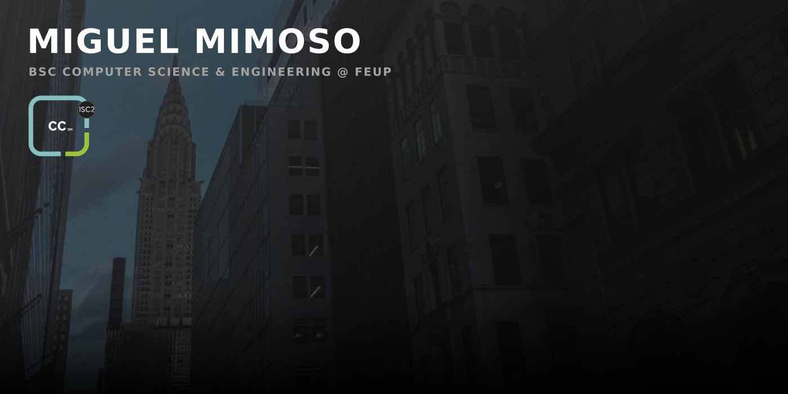
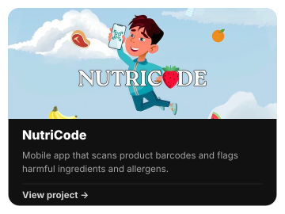
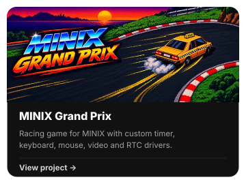
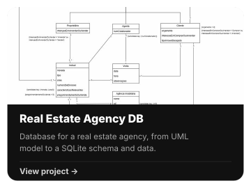

&nbsp;&nbsp;&nbsp;&nbsp;
&nbsp;&nbsp;&nbsp;&nbsp;
&nbsp;&nbsp;&nbsp;&nbsp;

## About

Computer Science & Engineering student at [FEUP](https://www.up.pt/feup/pt/), focused on cybersecurity, threat intelligence, and the point where technical security meets international affairs. Certified in Cybersecurity by ISC2 and a Foundation Level Threat Intelligence Analyst by arcX.

Member of the AI Security team at [**ARMISLAB@FEUP**](https://recrutamento.armislabfeup.com/), an R&D lab born from a partnership between [FEUP](https://www.up.pt/feup/pt/) and [ARMIS Group](https://www.armisgroup.com/). There I work on AI architectures for security alert analysis, comparing agentic designs on accuracy, consistency, and resistance to adversarial manipulation.

Beyond academia, I write on [Medium](https://medium.com/@msm05): OSINT CTF writeups on threat-actor attribution, geolocation, and missing-person cases, and long-form analysis on the war in Ukraine and European security. I also like building things, such as a portable hacking lab that fits in a suitcase, powered by a Raspberry Pi 4 running Kali Linux.

## Featured projects

