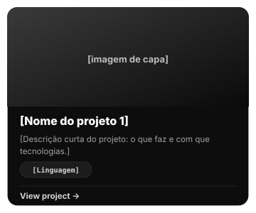
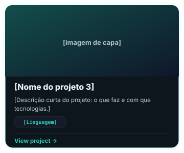

![[O teu nome]](banner.svg)

## About

[Parágrafo 1: curso, faculdade e interesses.]

[Parágrafo 2: associações, núcleos, laboratórios ou experiência relevante.]

[Parágrafo 3: hobbies e o que fazes fora do código.]

![[Linguagem]](https://img.shields.io/badge/-[Linguagem]-2dd4bf?style=flat&logoColor=111827)
![[Linguagem]](https://img.shields.io/badge/-[Linguagem]-2dd4bf?style=flat&logoColor=111827)
![[Linguagem]](https://img.shields.io/badge/-[Linguagem]-2dd4bf?style=flat&logoColor=111827)

## Featured projects

## Languages

